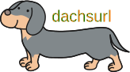

# dachsurl
URL短縮ツール(開発中) 🥺

<!-- https://www.apache.org/licenses/LICENSE-2.0 -->

[](https://github.com/practiceT/dachsurl/actions/workflows/build.yml)
[](https://coveralls.io/github/practiceT/dachsurl)
[](https://codebeat.co/projects/github-com-practicet-dachsurl-main)
[](https://goreportcard.com/report/github.com/practiceT/dachsurl)


## 概要
CLIによるシンプルなURL短縮ツール。
入力した冗長なURLをダックスフントの足のように短くします。
URLや足を長くしたいというご要望にはお応えできません。


## 使用方法
```
Usage:
  dachsurl [OPTIONS] [URLs...]

OPTIONS
    -t, --token <TOKEN>      bit.lyのトークンを指定します. (必須オプション)
    -c, --clipboard          短縮URLをクリップボードに出力します.
    -d, --delete             指定した短縮URLを削除します.
    -h, --help               このメッセージを表示し、終了します.
    -v, --version            バージョンを表示し、終了します.
ARGUMENT
    URL     URLは短縮用のURLを指定します。この引数は複数指定できます.
            引数が指定されていない場合、dachsurlは利用可能な短縮URLのリストを表示します.
```
※ 「-c, --clipboard」オプションを指定した状態で、複数URLを指定すると、一番最後のURLがクリップボードにコピーされます.


<!-- ## インストール方法

### Homebrew

```
brew install practicet/brew/dachshurl
```

### Docker

```
docker run -it --rm practicet/dachshurl:latest -t <token> <url...>
``` -->


## プロジェクトについて

### 開発者
HAYASHI Tomokazu

### ライセンス
[Apache License 2.0](http://www.apache.org/licenses/LICENSE-2.0)

- Permissions
  - ✅ Commercial use
  - ✅ Modification
  - ✅ Distribution
  - ✅ Patent use
  - ✅ Private use

- Limitations
  - ❌ Trademark use
  - ❌ Liability
  - ❌ Warranty

- Conditions
  - License and copyright notice
  - State changes

### アイコン
<!--  -->


### 名前の由来
URLをダックスフント(Dachshund)の足のように短くするという由来です。
